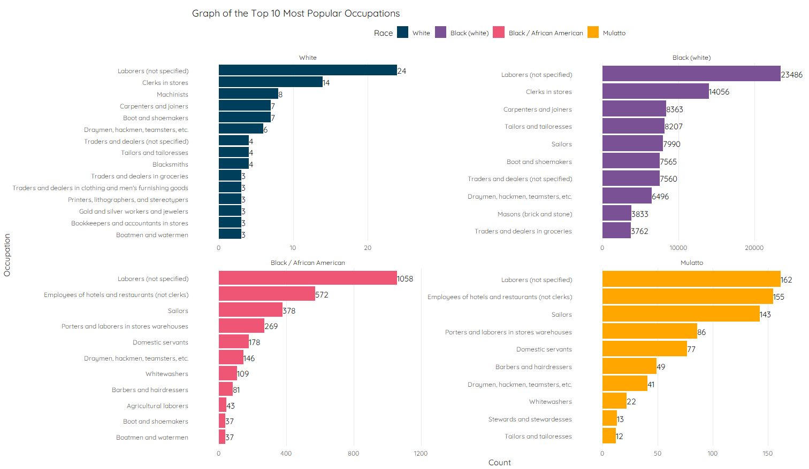

### 1. Set Up

```{r message = FALSE, cache = TRUE, warning = FALSE}
library(dplyr)
library(ggplot2)
library(treemap)
library(extrafont)
loadfonts()
library(knitr)
library(kableExtra)

mn_1850 = readr::read_csv("../Data/census_1850_occ_mn.csv") %>% mutate(city = "Manhattan")
bk_1850 = readr::read_csv("../Data/census_1850_occ_bk.csv") %>% mutate(city = "Brooklyn")
OCC_1880 = readr::read_csv("../Data/OCC1880.csv")

combined_1850 = rbind(mn_1850, bk_1850) %>% 
  select(age, sex, marst, race, labforce,
         occ, city) %>%
  left_join(OCC_1880, by = c("occ" = "code")) %>%
  mutate(race = factor(race,
                       levels = c(100,120,200,210,300),
                       labels = c("White", "Black (white)",
                                  "Black / African American",
                                  "Mulatto", "American Indian")),
         labforce = factor(labforce,
                           levels = c(0,1,2),
                           labels = c("N/A",
                                      "No, not in the labor force",
                                      "Yes, in the labor force")),
         sex = factor(sex,
                      levels = c(1,2),
                      labels = c("Male", "Female")),
         marst = factor(marst,
                        levels = c(1:6),
                        labels = c("Married, spouse present",
                                   "Married, spouse absent",
                                   "Separated",
                                   "Divorced",
                                   "Widowed",
                                   "Never married/single")))

theme_set(theme_minimal() + 
            theme(panel.grid.minor = element_blank(),
                  text = element_text(family = "Quicksand",
                                      colour = "gray5")))
```

### 2. Missing Data

#### a. Missing data by age, race and city

```{r cache = TRUE}
combined_1850 %>% 
  mutate(miss_occ = ifelse(occ == 999,1,0)) %>%
  ggplot(aes(y = age, x = race, col = factor(miss_occ))) +
  geom_jitter(alpha = 0.8,
              size = 1) + 
  facet_wrap(~city) +
  
  labs(y = "Age", x = "Race",
       col = "Missing") + 
  theme(legend.position = "top",
        panel.grid.major.y = element_blank()) +
  coord_flip()
```

* Missing data appears to be generally randomly scattered across the variables of age, race and city.
* However, it is noted that missing data tended to cluster below the age of 20

<br>

#### b. Missing data by labour force

```{r cache = TRUE}
combined_1850 %>% 
  mutate(miss_occ = ifelse(occ == 999,1,0)) %>%
  ggplot(aes(y = age, x = race, col = factor(miss_occ))) +
  geom_jitter(alpha = 0.8,
              size = 1) + 
  facet_wrap(~labforce) +
  
  labs(y = "Age", x = "Race",
       col = "Missing") + 
  theme(legend.position = "top",
        panel.grid.major.y = element_blank()) +
  coord_flip()
```

* It appears that generally, respondents who had a blank in their occupation, had also no response to the question of if therey were in the labour force.

```{r cache = TRUE}
combined_1850 %>%
  filter(occ != 999 &
           labforce == "No, not in the labor force") %>%
  count(label) %>%
  arrange(desc(n)) %>%
  kable() %>%
  kable_styling() %>%
  scroll_box(width = "100%", height = "300px")
```

* The results show that the responses which were indicated they were not in the labour force, but had an occupation were likely due to a mistake.

<br>

### 3. Demographics

```{r cache = TRUE}
sub_1850 = combined_1850 %>%
  filter(labforce == "Yes, in the labor force")
```

#### a. Age

```{rcache = TRUE}
var_mean_age = round(mean(sub_1850$age), digits = 0)

sub_1850 %>%
  mutate(mean_age = mean(age)) %>%
  
  ggplot(aes(x = age)) +
  geom_histogram(bins = 30, fill = "#f9a541") +
  geom_vline(xintercept = var_mean_age,
             linetype = "longdash",
             colour = "gray10") +
  geom_text(x = var_mean_age, y = 30000,
            label = var_mean_age,
            hjust = -0.5,
            colour = "gray10",
            family = "Quicksand") +
  theme(text = element_text(family = "Quicksand"))
```

##### (i) Respondents with Age above 80

```{r cache = TRUE}
sub_1850 %>%
  filter(age > 80) %>%
  arrange(desc(age)) %>%
  kable() %>%
  kable_styling() %>%
  scroll_box(width = "100%", height = "300px")
```

<br>

#### b. Occupation

* There are in total `r NROW(unique(sub_1850$label))` occupations within the data set.

```{r cache = TRUE}
sub_1850 %>%
  group_by(label) %>%
  summarise(count = n()) %>%
  
  treemap(index = "label",
          vSize = "count",
          vColor = "count",
          type = "index",
          palette = "YlGnBu",
          fontfamily.labels = "Quicksand",
          fontface.labels = "plain",
          fontfamily.title = "Quicksand",
          title = "Treemap of Occupations",
          lowerbound.cex.labels = 0.7)
```


###### (i) Top 10 Most Popular Occupations

```{r}
sub_1850 %>%
  group_by(label) %>%
  summarise(count = n()) %>%
  top_n(10, wt = count) %>%
  
  ggplot(aes(y = count, x = reorder(label, count))) +
  geom_col(fill = "#f9a541") + 
  coord_flip() + 
  geom_text(aes(label = count),
            hjust = 1.1,
            family = "Quicksand") + 
  
  labs(x = "", y = "Count",
       title = "Graph of the Top 10 Most Popular Occupations") +
  theme(panel.grid.major.y = element_blank(),
        legend.text = element_text(colour = "black"))
```

<br>

###### (ii) Top 10 Least Popular Occupations

```{r}
sub_1850 %>%
  group_by(label) %>%
  summarise(count = n()) %>%
  top_n(-10, wt = count) %>%
  
  ggplot(aes(y = count, x = reorder(label, -count))) +
  geom_col(fill = "#f9a541") + 
  coord_flip() + 
  geom_text(aes(label = count),
            hjust = 1.1,
            family = "Quicksand") + 
  
  labs(x = "", y = "Count",
       title = "Graph of the Top 10 Least Popular Occupations") +
  theme(panel.grid.major.y = element_blank(),
        legend.text = element_text(colour = "black"))
```

<br>

##### (iii) Table of Occupations

```{r cache = TRUE}
sub_1850 %>%
  group_by(label) %>%
  summarise(count = n()) %>%
  arrange(desc(count)) %>%
  as.data.frame(stringsAsFactors = FALSE) %>%
  kable() %>%
  kable_styling() %>%
  scroll_box(width = "100%", height = "300px")
```

<br>

### 4. In-depth into Occupation

#### a. Race and the Top 10 Occupations

```{r eval = FALSE}
col_4 = c("#003f5c", "#7a5195", "#ef5675", "#ffa600")

sub_1850 %>%
  group_by(label, race) %>%
  summarise(count = n()) %>%
  group_by(race) %>%
  top_n(10, count) %>%
  
  ggplot(aes(y = count, 
             x = tidytext::reorder_within(label, count, race),
             fill = race)) +
  geom_col() + 
  coord_flip() + 
  geom_text(aes(label = count),
            hjust = 0,
            family = "Quicksand") + 
  facet_wrap(~race, scales = "free") +
  
  scale_y_continuous(expand = c(0.15, 0)) +
  scale_x_discrete(labels = function(x) gsub("__.+$", "", x)) +
  scale_fill_manual(values = col_4) +
  
  labs(x = "Occupation", y = "Count", fill = "Race",
       title = "Graph of the Top 10 Most Popular Occupations") +
  theme(panel.grid.major.y = element_blank(),
        legend.text = element_text(colour = "black"),
        legend.position = "top")
```




